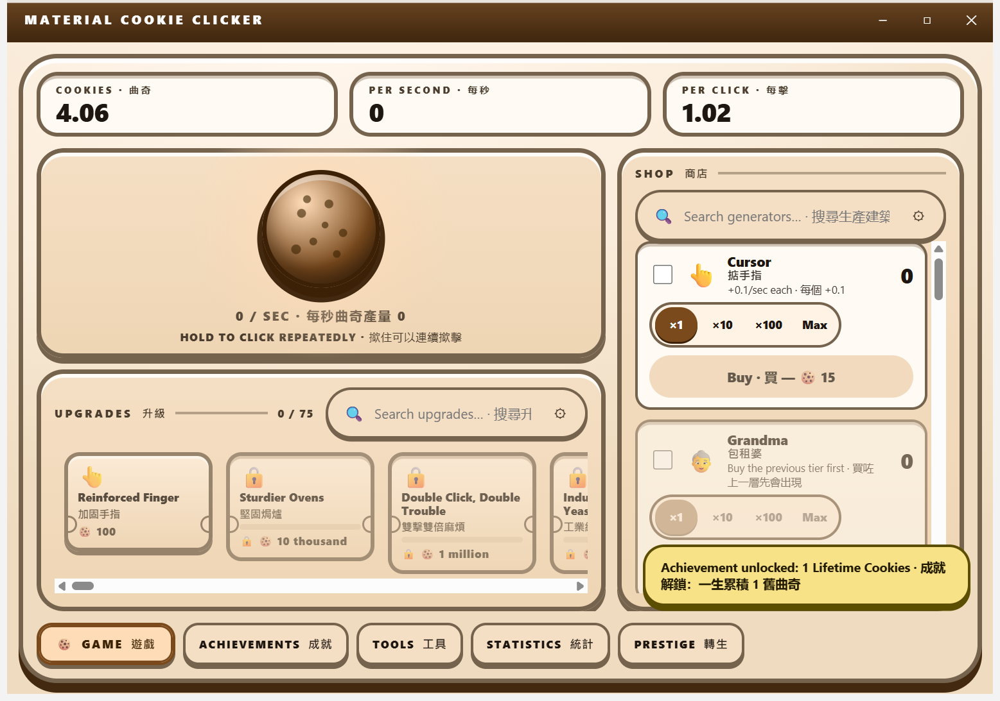
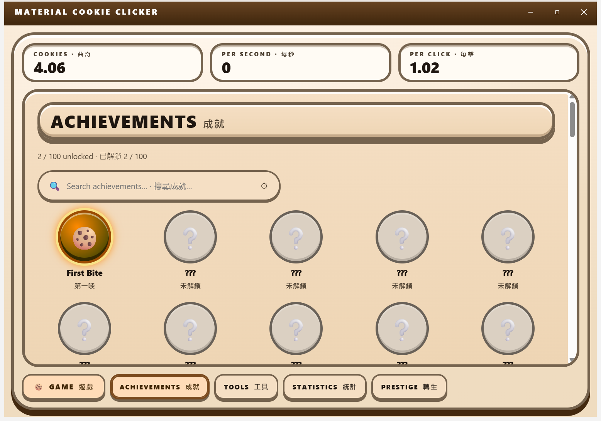
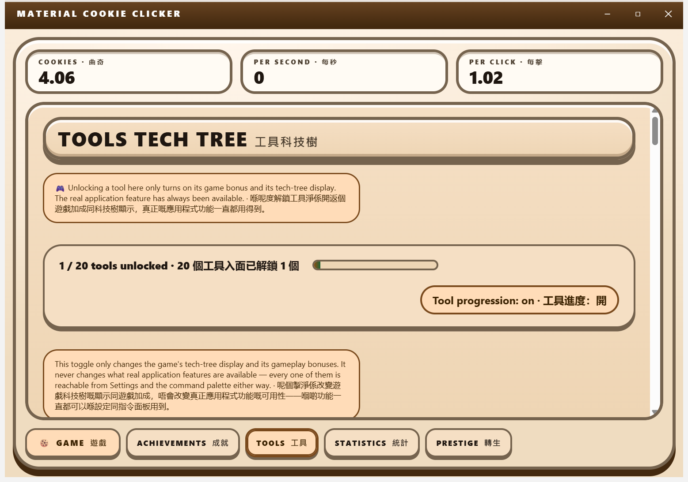
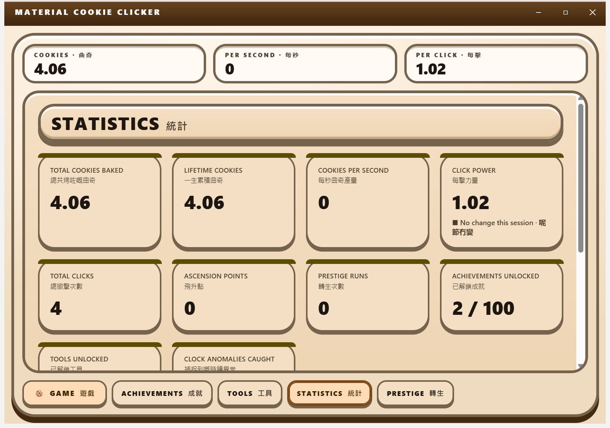
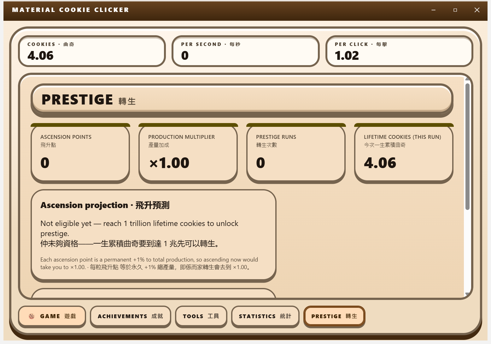

# Material Cookie Clicker

A Material Design 3 cookie clicker for Windows, built with Electron.

> [!NOTE]
> This project is in early construction. Nothing has been released yet: there is
> no published release, no verified installer, and no packaged runtime. Do not
> treat any capability described here as working until a release exists with
> attached, downloadable assets.

## Contents

- [What it is](#what-it-is)
- [The feature inventory is the tech tree](#the-feature-inventory-is-the-tech-tree)
- [Install](#install)
- [Build it yourself](#build-it-yourself)
- [Documentation](#documentation)

## What it is

An incremental game: click a cookie, buy generators that bake cookies for you,
spend upgrades to multiply the rate, unlock achievements, and ascend to trade
progress for a permanent multiplier.

It is a full desktop application rather than a page — bilingual English and
Hong Kong Cantonese with independent humour levels per language, Material
Design 3 throughout, keyboard and screen-reader operable, and it works with the
network unplugged.

**Nobody ever pays a penny to use it.** No purchase, no licence, no
subscription, no feature held behind a paywall.

## The feature inventory is the tech tree

This application's own features — the command palette, the regex builder, the
authenticator, the file converter, the local model manager, the appearance
editor and the rest — also appear inside the game as **tools** you discover and
unlock by playing, each granting a real gameplay bonus.

**An unlock gates the gameplay bonus and the in-game surfacing only. It never
gates the feature.** Every feature is reachable from settings and the command
palette at all times, whether or not its tool has been unlocked. Nobody should
have to farm cookies to get a regex builder, and this project's completeness
rules forbid satisfying a feature contract by hiding the feature — so the
separation is enforced in code and covered by a test, not left as an intention.

## Install

No release exists yet. A download button will appear here, and on the
documentation site, once a verified installer has actually been published.

Windows installers from this project are **unsigned** and will trigger the
operating system's unknown-publisher warning. That is expected, and is stated
plainly rather than worked around.

## Build it yourself

| Script | What it does |
| --- | --- |
| `download-dependencies.bat` | Obtains every dependency needed to build and run, into a user-scoped location |
| `build.bat` | Builds the runnable application, then offers to launch it |
| `build-installer.bat` | Produces the same unsigned installer the release pipeline publishes |

All three accept `/s`, `--silent`, and a `SILENT=1` environment variable for a
non-interactive run that exits non-zero on the first real failure.

## Documentation

Categorized feature documentation lives under `docs/`, and the documentation
site is published from `site/`.

## Captures

Real screenshots of the built application, taken from the packaged `dist/`
running on an off-screen desktop via Win32 PrintWindow (light theme). What
they do not show: the dark theme (never captured), a real-window narrow-width
resize (the shop-drawer breakpoint was verified by patching built CSS), or a
golden-cookie spawn.

The five shipped surfaces

| Surface | Capture |
| --- | --- |
| The single game surface — HUD, cookie hero, docked shop rail, upgrade ticket strip |  |
| Achievements tab — unlocked medal beside locked silhouettes, 2 / 100 counter |  |
| Tools tech tree — 1 / 20 unlocked, the always-available contract banner |  |
| Statistics tab — HUD-bezel stat tiles with tabular numerals |  |
| Prestige tab — ascension projection and the two-key destructive gate |  |

## License

Apache-2.0.
