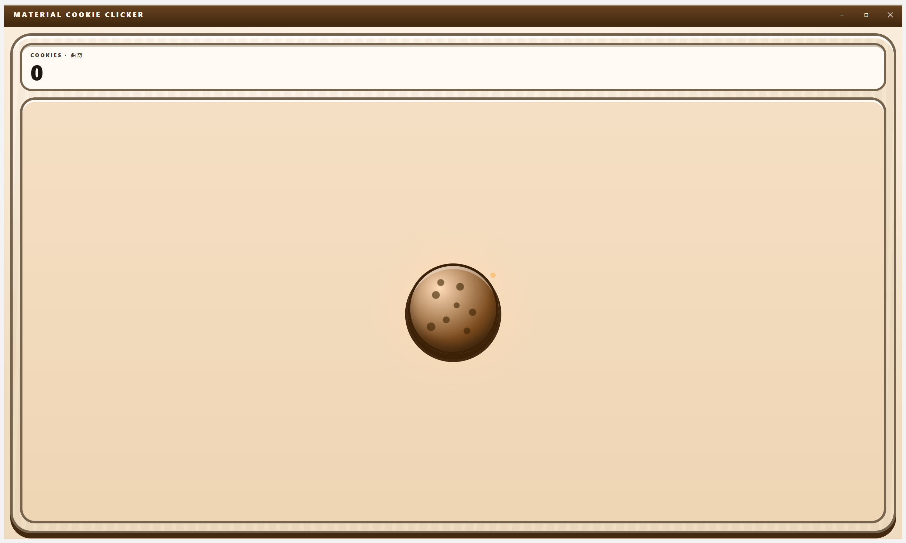
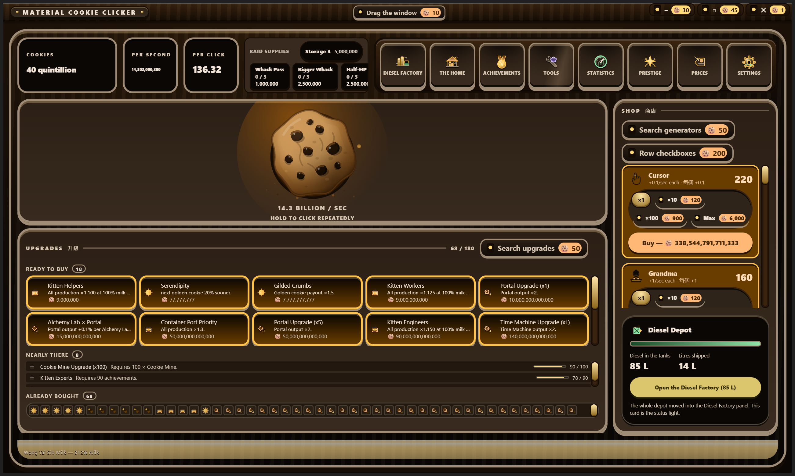
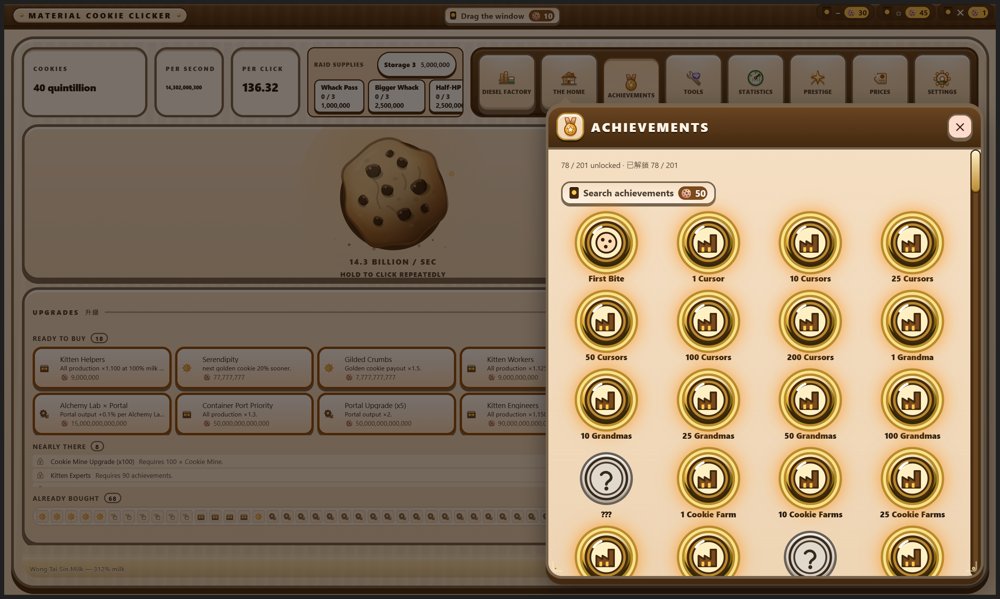

# Material Cookie Clicker

A Material Design 3 cookie clicker for Windows, built with Electron.

> [!NOTE]
> This project is in early construction. Nothing has been released yet: there is
> no published release, no verified installer, and no packaged runtime. Do not
> treat any capability described here as working until a release exists with
> attached, downloadable assets.

## Contents

- [What it is](#what-it-is)
- [The feature inventory is the tech tree](#the-feature-inventory-is-the-tech-tree)
- [Install](#install)
- [Build it yourself](#build-it-yourself)
- [Documentation](#documentation)

## What it is

An incremental game: click a cookie, buy generators that bake cookies for you,
spend upgrades to multiply the rate, unlock achievements, and ascend to trade
progress for a permanent multiplier.

It is a full desktop application rather than a page — bilingual English and
Hong Kong Cantonese with independent humour levels per language, Material
Design 3 throughout, keyboard and screen-reader operable, and it works with the
network unplugged.

**Nobody ever pays a penny to use it.** No purchase, no licence, no
subscription, no feature held behind a paywall.

## The feature inventory is the tech tree

This application's own features — the command palette, the regex builder, the
authenticator, the file converter, the local model manager, the appearance
editor and the rest — also appear inside the game as **tools** you discover and
unlock by playing, each granting a real gameplay bonus.

**An unlock gates the gameplay bonus and the in-game surfacing only. It never
gates the feature.** Every feature is reachable from settings and the command
palette at all times, whether or not its tool has been unlocked. Nobody should
have to farm cookies to get a regex builder, and this project's completeness
rules forbid satisfying a feature contract by hiding the feature — so the
separation is enforced in code and covered by a test, not left as an intention.

## Language and settings

The application ships a Settings panel, reachable from its gear emblem on the
cabinet console from the very first frame of a new save — it is an application
surface, not something the game unlocks. It holds a language-mode selector
(English, Cantonese, or both at once), which really does re-render every
surface in the app, and two independent 1–5 funny-level sliders, one per
language. The levels persist; the writing does not vary by level yet, because
every string in this build is written once per language, and the panel says so
plainly instead of implying otherwise.

## Install

No release exists yet. A download button will appear here, and on the
documentation site, once a verified installer has actually been published.

Windows installers from this project are **unsigned** and will trigger the
operating system's unknown-publisher warning. That is expected, and is stated
plainly rather than worked around.

### Automatic updates

An installed copy checks this repository's GitHub releases for a newer version
a while after it starts and then roughly every four hours, through the
Squirrel.Windows updater the installer sets up. It never blocks the game: the
check and the download happen outside the window, and a failure is a log line.
When a package has downloaded, a small corner card offers **Restart** or
**Later**.

Squirrel checks the downloaded package's bytes against the SHA1 recorded for it
in the `RELEASES` index it fetched over HTTPS, and refuses a package that does
not match. It cannot check who wrote that index — the artifacts are unsigned
and permanently will be — so the card says the update is unsigned and that
nothing proves who built it, rather than the word "verified". Running from
source has no updater in the process at all; it logs that and shows nothing.

## Build it yourself

| Script | What it does |
| --- | --- |
| `download-dependencies.bat` | Obtains every dependency needed to build and run, into a user-scoped location |
| `build.bat` | Builds the runnable application, then offers to launch it |
| `build-installer.bat` | Produces the same unsigned installer the release pipeline publishes |

All three accept `/s`, `--silent`, and a `SILENT=1` environment variable for a
non-interactive run that exits non-zero on the first real failure.

## Documentation

Categorized feature documentation lives under `docs/`, and the documentation
site is published from `site/`.

## Captures

Real screenshots of the built application, taken from the packaged `dist/`
running maximised on an off-screen Windows desktop and photographed window by
window via Win32 PrintWindow. Two of the nine start from a save written into the
running application's own storage to skip the grind; every purchase in them was
a real press of a real control. The dark-theme capture is the one thing that was
altered: `data-theme="dark"` was set on the built renderer's root element in
`dist/` and restored afterwards, because the application otherwise follows the
operating system's colour scheme.

What they still do not show: a real-window narrow-width resize — every capture
here is one maximised window, so the shop-drawer breakpoint remains verified by
forcing it rather than by resizing — a golden-cookie spawn, the prestige two-key
confirmation gate (it ships, but sits below the fold of the Prestige capture),
and the deep end of the generator ladder past Shipment, which no capture run has
reached. The Settings panel IS photographed now — the console emblem on a fresh
save, the panel itself, and the same window in Cantonese-only mode — but only
from a fresh profile, and never as reached from a tool card's "Open it now".

The nine captures of the current build

| What it shows | Capture |
| --- | --- |
| A fresh save: progressive disclosure at its starting point, one cookie and one number |  |
| The moment the shop is revealed, just after the Shop Sign upgrade is bought |  |
| The full surface on a progressed save — HUD, cookie hero, upgrade strip, shop rail, Diesel Depot |  |
| The same surface in the dark "arcade night" theme |  |
| Achievements, open as an anchored dialog over the dimmed game |  |
| The Tools tech tree, with the no-gating contract stated on the surface |  |
| Statistics — ten counters, including the clock-anomaly count |  |
| Prestige — the ascension projection below the threshold |  |
| The Diesel Depot mid-mint, one frame of the pump animation |  |

Older captures from earlier lanes are still on disk under `captures/`, and
`captures/README.md` says what each of them was.

## License

Apache-2.0.
